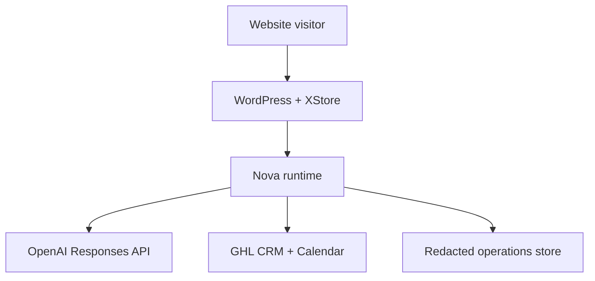

> **SUPERSEDED:** the `/v1/sessions*` API documented in this sprint-002 draft was removed from `apps/nova-website-advisor-runtime` in the service-tier expansion pass. Production Nova traffic runs through `/v1/discovery` (`src/discovery-router.ts`, `src/discovery-api-contract.ts`). Retained as a historical artifact; do not treat as current.

# Nova Website Advisor Technical Architecture

## 1. Purpose

This document converts the approved Sprint 001 product specification into an implementation-ready Release 1 technical architecture. It defines system boundaries, components, data flows, contracts, controls, environments, failure behavior, validation, and the implementation sequence.

It does not deploy software, select secret values, connect an API, alter GHL, modify production WordPress, or activate Nova.

## 2. Architecture decision summary

Release 1 should use a Moonrock-controlled, server-side orchestration service between the public WordPress interface and all external systems.

Recommended baseline:

| Layer | Decision |
|---|---|
| Public presentation | Existing WordPress/XStore child theme |
| Chat client | Small accessible JavaScript client loaded only where Nova is enabled |
| Runtime boundary | Moonrock-controlled TypeScript edge service |
| Preferred host | Cloudflare Workers, subject to account and cost approval |
| Conversation API | OpenAI Responses API |
| Primary model | Configured deployment variable; initial evaluation candidate `gpt-5.4-mini` |
| Model escalation | Disabled in Release 1 unless a separately evaluated route is approved |
| Knowledge | Published, versioned Release 1 knowledge bundle; no open-web retrieval |
| CRM/calendar | GHL through documented APIs only |
| Runtime state | Short-lived session/state store separate from WordPress and GHL |
| Durable business record | GHL contact, opportunity, booking, consent, and handoff records |
| Audit/operations | Redacted structured event log and metrics |
| Secrets | Host-managed secret store; never browser, WordPress markup, GitHub, prompts, or logs |

The model is a reasoning and language component. Deterministic application code retains authority for consent, state transitions, routing gates, field validation, tool eligibility, record creation, and booking confirmation.

## 3. Architecture principles

1. Preserve the current WordPress/XStore implementation.
2. Keep provider credentials and protected operations off WordPress and out of the browser.
3. Treat model output as untrusted until schema, policy, and state validation succeed.
4. Use deterministic rules for authority, consent, protected topics, tool access, and terminal states.
5. Provide anonymous guidance without mandatory CRM creation.
6. Minimize data sent to every provider.
7. Keep GHL as the business system of record, not the model's memory.
8. Use versioned knowledge and prompts with an auditable release manifest.
9. Require receipts before claiming external success.
10. Fail closed for protected actions and fail usefully for routine guidance.
11. Make the runtime stoppable without taking down the Moonrock website.
12. Avoid new subscriptions or infrastructure until the current-stack review and pilot justify them.

## 4. Context and trust boundaries



Trust boundaries:

- **Browser boundary:** all client input, browser state, and page content are untrusted.
- **WordPress boundary:** WordPress presents the client but has no OpenAI or GHL secret.
- **Runtime boundary:** the orchestration service is the only component allowed to invoke model and CRM/calendar providers.
- **Model boundary:** model responses and requested tool calls are proposals, not authorization.
- **GHL boundary:** GHL is authoritative for contacts, opportunities, calendar records, and consent evidence defined in Sprint 001.
- **Operations boundary:** logs are evidence, not a business system of record.

## 5. Component design

### 5.1 WordPress integration shell

Responsibilities:

- render the existing approved Nova identity and assets;
- launch and close the chat panel;
- show AI disclosure, privacy notice, and human-handoff control;
- collect messages and explicit consent actions;
- stream assistant-visible text;
- display action status only from signed runtime events;
- preserve keyboard, screen-reader, mobile, contrast, focus, and reduced-motion behavior;
- expose a no-JavaScript/manual contact fallback.

Prohibited:

- embedding provider keys or GHL tokens;
- directly calling OpenAI or GHL;
- storing raw transcripts in WordPress;
- deciding qualification, consent, or authority in browser code;
- claiming a booking from client-side calendar state alone.

Recommended repository location for a later implementation:

```text
xstore-child/
  assets/
    css/nova-advisor.css
    js/nova-advisor.js
  template-parts/
    nova-advisor-shell.php
```

Sprint 002 creates none of these files.

### 5.2 Nova runtime gateway

Responsibilities:

- enforce allowed origins and request size;
- issue opaque session and correlation identifiers;
- apply rate, abuse, and concurrency limits;
- validate request schema and lifecycle state;
- redact or block prohibited sensitive values;
- assemble the approved instruction and knowledge context;
- invoke the configured model;
- validate structured model output;
- independently authorize or reject proposed tool calls;
- call GHL through a narrow adapter;
- stream safe response events;
- record redacted operational evidence;
- stop, degrade, or route manually on failure.

The runtime must be stateless where practical. Durable state belongs in explicit stores, not process memory.

### 5.3 Conversation orchestrator

The orchestrator owns the Sprint 001 lifecycle state machine:

```text
OPENED
  -> DISCLOSED
  -> INTENT_IDENTIFIED
  -> DISCOVERY_IN_PROGRESS
  -> ROUTE_PROPOSED
  -> CONSENT_REQUESTED
  -> ADMINISTRATIVE_ACTION_PENDING
  -> terminal state
```

Transitions are server-validated. The model may propose:

- intent and confidence;
- next discovery question;
- preliminary summary;
- route recommendation;
- escalation flag;
- draft user-facing response.

The model may not directly set:

- consent status;
- authenticated identity;
- qualification approval;
- opportunity stage;
- booking success;
- external record success;
- authority level below the deterministic minimum;
- a protected-action completion state.

### 5.4 Policy and authority engine

This deterministic layer evaluates:

- current lifecycle state;
- intent and risk signals;
- consent evidence;
- knowledge/source eligibility;
- requested tool;
- required fields;
- authority level;
- rate/volume limits;
- escalation rules;
- runtime and dependency health.

Decision result:

```json
{
  "decision": "allow | deny | require_consent | require_human | degrade",
  "reasonCode": "stable-enumerated-code",
  "requiredState": "optional-state",
  "allowedTool": "optional-tool-name",
  "auditSeverity": "info | warning | critical"
}
```

Policy rules are versioned code/configuration. They are not generated dynamically by the model.

### 5.5 Model adapter

Use the OpenAI Responses API for new implementation. The adapter must:

- pin a tested model snapshot or controlled alias through environment configuration;
- send versioned instructions;
- request a strict structured response;
- expose only the minimum approved tools;
- set explicit token, latency, and cost ceilings;
- attach correlation metadata without personal data;
- handle refusal, incomplete, timeout, throttling, and provider errors;
- prevent model response identifiers from becoming the business session ID;
- support a provider-off/manual-fallback mode.

Initial model candidate:

- `gpt-5.4-mini` for Release 1 evaluation because the current model catalog lists Responses API, streaming, function calling, and structured-output support.

This is an evaluation candidate, not production approval. The deployment manifest must identify the tested model identifier, snapshot/alias, prompt version, evaluation result, approver, and effective date. A model change is a release change.

### 5.6 Knowledge publisher and runtime bundle

Release 1 must not browse the public web during a visitor conversation.

The knowledge pipeline is:

1. identify approved source documents;
2. extract only public-safe approved content;
3. attach source ID, title, authority, version, effective date, owner, and expiry/review date;
4. validate conflicts and missing fields;
5. publish an immutable knowledge bundle;
6. calculate a content hash;
7. reference the bundle version in each conversation event.

Recommended bundle objects:

```text
manifest.json
persona.json
intents.json
discovery.json
offers.json
resources.json
faqs.json
policies.json
routing.json
escalations.json
```

The bundle must not contain credentials, internal-only operational data, client records, draft pricing, or unapproved claims.

Release 1 retrieval should use deterministic metadata filtering plus bounded text retrieval. File-search/vector retrieval may be evaluated later, but it must not bypass source authority, expiry, public classification, or citation rules.

### 5.7 GHL adapter

The adapter exposes business-level methods instead of unrestricted API access:

- `findContactCandidates`
- `createContact`
- `updateContactWithConsent`
- `createOpportunityForReview`
- `createFollowUpTask`
- `listApprovedSlots`
- `requestAppointment`
- `recordConversationSummary`
- `recordConsentEvidence`
- `recordEscalation`

Every method must define:

- required consent and lifecycle state;
- exact request/response schema;
- field allowlist;
- scopes/permissions;
- idempotency key;
- timeout;
- retry class;
- reconciliation behavior;
- receipt requirements;
- audit event;
- manual fallback.

No generic “call GHL endpoint” tool may be available to the model.

### 5.8 Session and transcript store

The runtime needs a short-lived state store for:

- opaque session ID;
- lifecycle state;
- disclosure version;
- message sequence;
- consent state;
- intent and confidence;
- risk/escalation flags;
- knowledge, model, and prompt versions;
- pending action/idempotency state;
- expiration.

Raw transcript storage is disabled by default until the retention, consent, access, deletion, and redaction decisions from Sprint 001 are approved.

The default Release 1 design should retain:

- short-lived active-session context;
- a redacted structured summary when consent and routing require it;
- operational events with no message body;
- a raw transcript only when separately consented and approved.

### 5.9 Operations and observability

Required structured events:

- `session.opened`
- `disclosure.presented`
- `message.accepted`
- `message.blocked`
- `intent.classified`
- `route.proposed`
- `consent.requested`
- `consent.recorded`
- `tool.requested`
- `tool.denied`
- `tool.started`
- `tool.succeeded`
- `tool.outcome_unknown`
- `tool.failed`
- `handoff.created`
- `booking.confirmed`
- `escalation.created`
- `session.completed`
- `session.abandoned`
- `session.expired`
- `runtime.degraded`

Event fields must include correlation ID, event name, timestamp, environment, release versions, state, duration, outcome, and safe reason code. Do not log raw secrets, full messages, chain-of-thought, payment data, or unnecessary personal information.

## 6. Public runtime contract

### 6.1 Base rules

- HTTPS only.
- JSON requests.
- Server-sent events (SSE) for Release 1 streaming.
- No browser-held provider credential.
- Allowed origin restricted to approved Moonrock domains.
- Request body and message length limits.
- Per-session monotonically increasing sequence number.
- Correlation ID returned on every response.
- CSRF/origin protection appropriate to the final integration.

### 6.2 Endpoints

| Method | Endpoint | Purpose |
|---|---|---|
| `POST` | `/v1/sessions` | Start anonymous session and return disclosure |
| `POST` | `/v1/sessions/{id}/messages` | Submit one visitor message |
| `GET` | `/v1/sessions/{id}/events` | Stream authorized response events |
| `POST` | `/v1/sessions/{id}/consents` | Record explicit consent action |
| `POST` | `/v1/sessions/{id}/handoffs` | Request human follow-up |
| `POST` | `/v1/sessions/{id}/bookings` | Request an appointment |
| `POST` | `/v1/sessions/{id}/close` | Close or decline further processing |
| `GET` | `/health/live` | Process liveness |
| `GET` | `/health/ready` | Dependency-aware readiness |

No endpoint accepts an authority-level override, opportunity-stage override, consent boolean without disclosure/action evidence, raw GHL object, arbitrary tool name, model name, or system prompt.

### 6.3 Message request

```json
{
  "messageId": "client-generated-uuid",
  "sequence": 3,
  "text": "Visitor message",
  "page": {
    "path": "/",
    "referrerClass": "direct | search | campaign | internal | unknown"
  },
  "client": {
    "locale": "en-US",
    "timeZone": "America/Chicago"
  }
}
```

UTM values may be captured separately using an allowlist. Full referrer URLs must not expose sensitive query values.

### 6.4 Stream events

Allowed browser events:

- `response.started`
- `response.delta`
- `response.completed`
- `disclosure.required`
- `consent.required`
- `handoff.available`
- `booking.slots`
- `booking.confirmed`
- `action.pending`
- `action.failed`
- `session.completed`
- `runtime.degraded`
- `error`

Internal reason codes, qualification scores, risk signals, stack traces, provider payloads, and private notes are never sent unless explicitly classified as public.

### 6.5 Model output contract

```json
{
  "responseText": "string",
  "primaryIntent": "LAUNCH",
  "secondaryIntents": [],
  "intentConfidence": "high | medium | low",
  "facts": [],
  "visitorStatements": [],
  "inferences": [],
  "unknowns": [],
  "knowledgeCitations": [
    {
      "sourceId": "string",
      "version": "string",
      "section": "string"
    }
  ],
  "recommendedState": "DISCOVERY_IN_PROGRESS",
  "recommendedRoute": "string | null",
  "riskSignals": [],
  "requestedTool": null,
  "requestedToolArguments": null
}
```

Schema validation is necessary but not sufficient. Policy validation follows it.

## 7. Core data flows

### 7.1 Anonymous guidance

1. Browser requests a session.
2. Runtime returns AI disclosure and session ID.
3. Visitor submits a message.
4. Gateway validates, rate-limits, and redacts.
5. Orchestrator assembles approved knowledge context.
6. Model returns structured draft.
7. Schema and policy engines validate output.
8. Runtime streams safe text and persists minimal state.
9. No GHL record is created.

### 7.2 Consented follow-up

1. Nova proposes human follow-up.
2. Runtime returns required disclosure and channel-specific consent controls.
3. Visitor affirmatively selects purpose/channel and submits contact details.
4. Runtime validates consent evidence and contact fields.
5. GHL adapter searches for possible duplicates.
6. Runtime creates, updates, or flags for human resolution.
7. Runtime records consent and creates a follow-up task.
8. Success is shown only after receipts are recorded.
9. Human receives the Sprint 001 summary.

### 7.3 Booking

1. Visitor requests booking.
2. Runtime validates appointment type and required consent.
3. GHL adapter retrieves approved live slots.
4. Visitor selects a slot and confirms time zone/contact channel.
5. Runtime creates an idempotent booking request.
6. GHL returns an appointment ID or uncertain/failure outcome.
7. Runtime confirms only a valid receipt.
8. Unknown outcome is reconciled before any retry.

### 7.4 Mandatory escalation

1. Deterministic filter or model identifies a trigger.
2. Policy engine stops normal sales/discovery progression.
3. Nova provides approved boundary language.
4. Runtime collects only minimum routing information.
5. GHL task/escalation record is created when authorized.
6. Critical security/privacy events also alert the designated owner.
7. Runtime enters `ESCALATED` and prevents protected tool use.

## 8. State, identity, and retention

### 8.1 Session identity

- Session IDs must be random, opaque, and non-identifying.
- Cookie use must be limited and classified before implementation.
- Release 1 does not authenticate an anonymous visitor.
- A supplied name, email, phone, title, or claim of authority is not authenticated identity.
- Existing-client support requiring account detail must hand off or use a separately approved authentication flow.

### 8.2 State ownership

| Data | System of record |
|---|---|
| Active anonymous session | Runtime state store |
| Contact and channel consent | GHL/approved consent record |
| Opportunity | GHL |
| Appointment | GHL calendar |
| Approved knowledge | Versioned release bundle |
| Prompt/policy/runtime version | Release manifest |
| Operational event | Operations store |
| Raw transcript | Approved transcript store, if activated |

### 8.3 Retention

Exact periods remain an approval dependency. The implementation must support independent retention for:

- anonymous session content;
- raw transcripts;
- redacted summaries;
- consent evidence;
- operational logs;
- security/incident evidence;
- GHL business records.

Expiration must delete or de-identify according to the approved schedule and preserve legal holds where applicable.

## 9. Security architecture

### 9.1 Required controls

- TLS for all traffic.
- Strict allowed-origin policy.
- Content Security Policy compatible with the approved widget.
- No inline secret or sensitive configuration.
- Host-managed secrets with separate non-production and production values.
- Least-privilege OpenAI and GHL credentials.
- Dependency and permission allowlists.
- Schema validation at every boundary.
- Request size, token, duration, rate, and cost limits.
- Prompt-injection and data-exfiltration defenses.
- Sensitive-data detection/redaction.
- Output encoding and safe DOM rendering.
- Webhook signature and replay validation if webhooks are introduced.
- Audit events for permission, tool, consent, and escalation decisions.
- Dependency timeout and circuit breaker.
- Runtime kill switch.

### 9.2 Prompt-injection containment

- Instructions and policy are server-owned.
- Website, user, retrieved, and tool content are always labeled untrusted.
- The model receives no provider secret.
- Tool names and arguments are schema constrained.
- The model cannot choose arbitrary URLs, recipients, pipeline stages, fields, or API methods.
- The policy engine reauthorizes every tool request.
- Knowledge retrieval filters by approved source metadata before text reaches the model.
- Tool output is treated as data and validated independently.

### 9.3 Abuse controls

Implement:

- per-IP and per-session rate limits with privacy review;
- session/message/token ceilings;
- bot and replay indicators;
- duplicate message detection;
- repeated-injection threshold;
- temporary session suspension;
- safe response for abusive content;
- owner alert for sustained attack or cost anomaly.

Abuse signals must not be used for unrelated profiling.

## 10. Reliability and transaction safety

### 10.1 Idempotency keys

| Action | Key |
|---|---|
| Message acceptance | `sessionId:messageId` |
| Contact create/update | `sessionId:contactConsentVersion` |
| Follow-up task | `sessionId:routeVersion` |
| Opportunity creation | `sessionId:opportunityIntentVersion` |
| Booking request | `sessionId:calendarId:slotStart` |
| Consent record | `sessionId:consentType:disclosureVersion:actionId` |

Keys must not embed email, phone, or personal data.

### 10.2 Retry classes

- **Safe retry:** read-only availability lookup, health check.
- **Conditional retry:** model call before user-visible completion, bounded and correlated.
- **Reconcile before retry:** contact, opportunity, task, consent, booking, or communication write.
- **Never automatic retry:** action denied by policy, invalid consent, non-retryable validation, protected action, authentication failure.

Use bounded exponential backoff with jitter. Exact thresholds belong in the deployment configuration and test evidence.

### 10.3 Partial failure

If a contact is created but task creation fails:

1. record partial state;
2. do not recreate the contact;
3. reconcile using the idempotency key;
4. create the missing task if safe;
5. otherwise route manual completion;
6. tell the visitor only what is confirmed.

Equivalent reconciliation is required for every multi-step write.

## 11. Degraded modes

| Mode | Trigger | Visitor behavior |
|---|---|---|
| Normal | All required dependencies healthy | Full approved Release 1 |
| Knowledge-only | GHL unavailable | Anonymous guidance; manual contact link; no booking claim |
| Handoff-only | Model unavailable or quality circuit open | Approved static paths and human contact |
| Booking-link fallback | GHL API write disabled but approved public calendar available | Direct visitor-controlled booking link |
| Static fallback | Runtime unavailable | Existing contact/Flight Plan CTAs remain usable |
| Closed | Security/privacy incident or kill switch | Nova disabled; approved notice and human route |

Degraded mode must never loosen consent, authority, or validation.

## 12. Environments and configuration

Required environments:

- **Local:** mocks and synthetic data only.
- **Test:** automated contract, policy, and adversarial tests.
- **Staging:** production-like services with non-production GHL/OpenAI configuration and synthetic contacts.
- **Production:** explicit release approval and least-privilege credentials.

Configuration classes:

- public non-sensitive settings;
- protected runtime settings;
- secret values;
- release manifest;
- emergency controls.

Environment promotion requires immutable artifact/version identifiers. Production configuration must not be copied back into lower environments.

## 13. Release manifest

Every deployable release must identify:

```yaml
release_id: nova-web-r1
runtime_version: pending
client_version: pending
prompt_version: pending
policy_version: pending
knowledge_bundle_version: pending
knowledge_bundle_hash: pending
model_id: pending-evaluation
model_snapshot_or_alias: pending
ghl_contract_version: pending
privacy_notice_version: pending
consent_disclosure_version: pending
approved_by: pending
approved_at: pending
rollback_release_id: pending
```

The manifest contains identifiers, never secret values.

## 14. Observability and alerts

### 14.1 Service indicators

- runtime availability;
- time to first safe response;
- full response duration;
- model error/throttle/timeout rate;
- GHL read/write error and uncertain-outcome rate;
- duplicate-prevention events;
- false booking confirmations;
- policy denials and escalation counts;
- unsupported-claim evaluation rate;
- prompt-injection containment rate;
- cost per completed conversation;
- sessions by completion state;
- handoff completeness;
- consent recording failures.

### 14.2 Severity

- **Critical:** data exposure, unauthorized protected action, false booking at scale, consent bypass, cross-client disclosure, kill-switch failure.
- **High:** repeated unsafe claims, GHL duplicate creation, escalation routing failure, transcript control failure.
- **Medium:** elevated timeout, incomplete summary, knowledge expiry, abnormal correction rate.
- **Low:** isolated recoverable client or formatting failure.

Each alert requires an owner, destination, response expectation, suppression rule, escalation path, and closure evidence before production.

## 15. Kill switch and rollback

Kill controls must independently disable:

- new sessions;
- model calls;
- GHL reads;
- GHL writes;
- booking writes;
- transcript retention;
- knowledge release;
- a specific prompt/model/runtime version.

Shutdown must preserve evidence and allow the WordPress site to continue serving approved static CTAs.

Rollback order:

1. disable affected tool or release flag;
2. drain or quarantine pending work;
3. restore the last approved runtime/prompt/policy/knowledge manifest;
4. reconcile uncertain GHL actions;
5. validate static fallback;
6. obtain human restart approval;
7. observe the restarted release.

## 16. Testing architecture

### 16.1 Automated suites

- JSON/schema contracts;
- lifecycle transitions;
- authority and consent policy tables;
- knowledge allowlist, expiry, and citation;
- GHL adapter with recorded synthetic fixtures;
- idempotency and concurrent duplicates;
- timeout, throttle, partial success, and uncertain outcome;
- browser accessibility and responsive behavior;
- output encoding and injection;
- prompt-injection and exfiltration cases from Sprint 001;
- evaluation dataset for intent, route, boundary, accuracy, and tone;
- cost/token/latency ceilings;
- kill switch and fallback.

### 16.2 Evaluation gates

The model/prompt/knowledge combination is one versioned unit. Promotion requires:

- 100% protected-action containment in the approved critical set;
- 100% valid consent gating in the approved critical set;
- zero fabricated tool success;
- zero cross-client/secret disclosure;
- all mandatory escalation cases correctly contained;
- approved thresholds for intent, routing, factuality, citation, tone, and latency;
- human review of high-impact external responses.

Exact noncritical thresholds are set before pilot and may not be changed to make a failing release pass without a recorded decision.

## 17. Implementation work packages

### WP-1 — Ownership and decisions

- Assign owners.
- Approve preferred host and budget ceiling.
- Approve model evaluation candidates.
- Resolve Sprint 001 open privacy, consent, calendar, and service-level decisions.

### WP-2 — Contracts and schemas

- Finalize endpoint OpenAPI document.
- Finalize model-output JSON Schema.
- Finalize GHL field and method contracts.
- Finalize event taxonomy and release manifest schema.

### WP-3 — Knowledge publisher

- Build public-safe extraction and manifest process.
- Create initial approved bundle.
- Add expiry/conflict validation.

### WP-4 — Runtime foundation

- Implement gateway, sessions, lifecycle, policy engine, model adapter, and streaming.
- Implement secret/config separation, rate limits, and degraded modes.

### WP-5 — GHL sandbox adapter

- Implement narrow methods.
- Add duplicate, idempotency, reconciliation, and receipt handling.
- Validate consent and booking behavior with synthetic records.

### WP-6 — WordPress client

- Build accessible shell in the child theme.
- Integrate existing Nova assets and approved CTAs.
- Add human/static fallback.

### WP-7 — Validation and pilot readiness

- Run automated and human evaluations.
- Complete threat, privacy, accessibility, and operational reviews.
- Validate kill switch, rollback, manual handoff, and monitoring.

### WP-8 — Separate production decision

- Present pilot evidence.
- Approve or reject production release.
- No Sprint 002 artifact authorizes deployment.

## 18. Decisions still required

| Decision | Owner | Required before |
|---|---|---|
| Cloudflare Workers or approved alternative host | Executive/technical | WP-4 |
| OpenAI project, data controls, and spend ceiling | Executive/data/technical | Model testing |
| Model candidate and pinned release identifier | Product/technical | Staging |
| Session and transcript retention periods | Privacy/records | State implementation |
| Raw transcript default | Privacy/executive | GHL integration |
| GHL integration type and scopes | CRM/security | WP-5 |
| GHL field mapping and pipeline stages | CRM/sales | WP-5 |
| Calendar IDs, hours, owners, and fallback | Sales/operations | Booking tests |
| Consent language and channel policy | Privacy/legal/business | Contact writes |
| Support and escalation destinations | Operations/executive | Pilot |
| Alert thresholds and on-call destination | Runtime owner | Staging |
| Pilot volume, duration, stop conditions | Executive/product | Pilot |

## 19. External technical references

Current platform facts used for this architecture must be revalidated at implementation:

- [OpenAI — Migrate to the Responses API](https://developers.openai.com/api/docs/guides/migrate-to-responses)
- [OpenAI — Function calling](https://developers.openai.com/api/docs/guides/function-calling)
- [OpenAI — Model catalog](https://developers.openai.com/api/docs/models)
- [OpenAI — Safety best practices](https://developers.openai.com/api/docs/guides/safety-best-practices)
- [HighLevel API developer portal](https://marketplace.gohighlevel.com/docs/)
- [WordPress REST API authentication](https://developer.wordpress.org/rest-api/using-the-rest-api/authentication/)
- [Cloudflare Workers documentation](https://developers.cloudflare.com/workers/)
- [Cloudflare Workers rate limiting](https://developers.cloudflare.com/workers/runtime-apis/bindings/rate-limit/)

## 20. Sprint 002 acceptance

Sprint 002 is complete when:

- the architecture is reviewed against Sprint 001 and governing Program 006/007 standards;
- component and trust boundaries are explicit;
- public, model, GHL, state, knowledge, and event contracts are defined;
- consent and authority remain deterministic;
- security, privacy, reliability, observability, degraded-mode, kill-switch, rollback, and test designs are present;
- implementation work packages and unresolved decisions are assigned to future gates;
- no API, credential, GHL, WordPress production, or deployment change occurs;
- the owner approves the draft pull request before merge.

